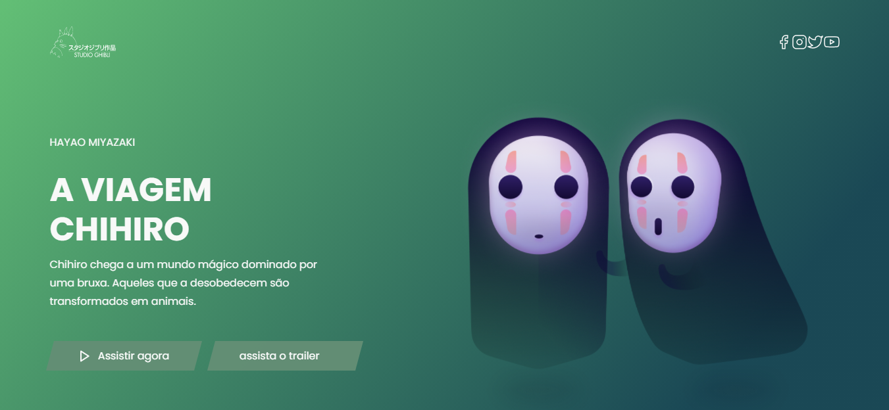

<h1 align="center">Desafio 5👋</h1>
<p>
  <a href="#" target="_blank">
    
  </a>
</p>

> Desafio 5 da codelandia do Iuri Silva finalizado com sucesso

Veja o projeto final aqui:(https://jeffbeu.github.io/Desafio-5/)

## Run tests

```sh
just open index.html live server
```

## Author

👤 **JEFF (Douglas)**

* Website: http://douglasportifolio.tk/
* Github: [@jeffbeu](https://github.com/jeffbeu)
* LinkedIn: [@https:\/\/www.linkedin.com\/in\/douglas-oliveira-305961160\/](https://linkedin.com/in/https:\/\/www.linkedin.com\/in\/douglas-oliveira-305961160\/)

## Show your support

Give a ⭐️ if this project helped you!

***
_This README was generated with ❤️ by [readme-md-generator](https://github.com/kefranabg/readme-md-generator)_
